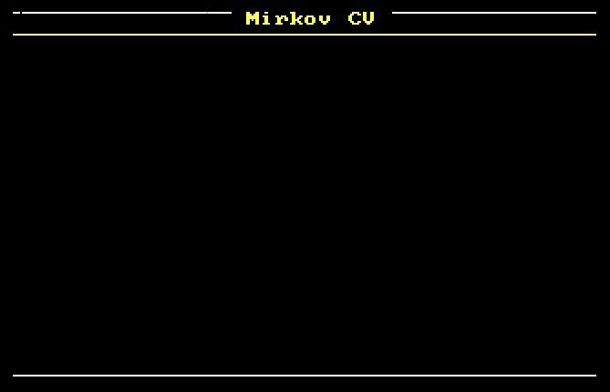
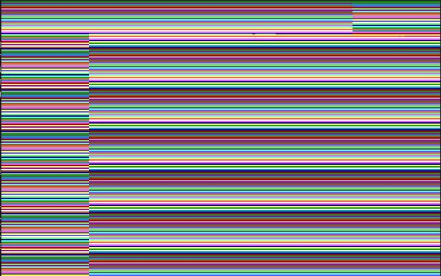
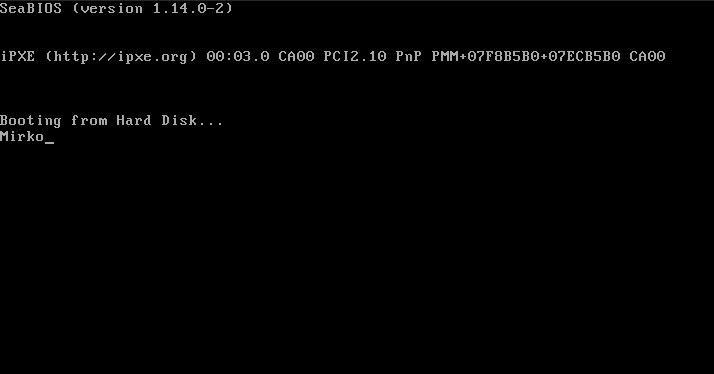

# boot_sector_game
Assembly BIOS programming, program that implements bootable CV/game

### Version 4: 

 

### Version 3: 

 

### Version 2: 

 

### Version 1: 

 

###todo:
- [ ] finish the boot loader game
- [ ] merge that binary into pdf file
- [ ] version1: game and game_doc.pdf
- [ ] version2: CV and CVinPDF.pdf
